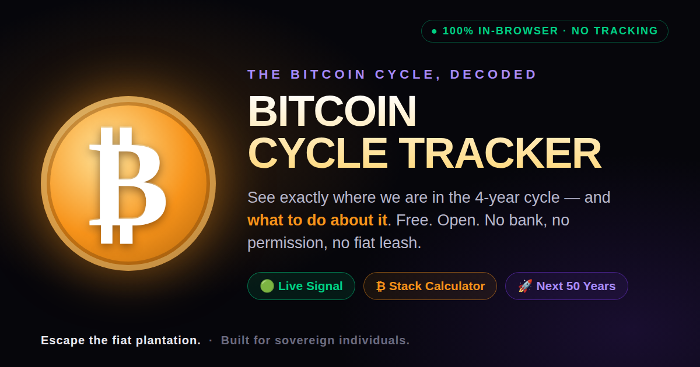

# ₿ Bitcoin Cycle Tracker

**See exactly where Bitcoin is in its 4-year cycle — and what to do about it.**

A single-page web app that maps the Bitcoin halving cycle, gives you a plain-English
signal, lets you size your stack, shows live on-chain intel, and paints a 50-year
vision of what Bitcoin becomes. Built for everyone from your no-coiner uncle to the
people who already get it.

🔗 **Live:** https://hi22609.github.io/DiscordChatExporter/bitcoin-app/



---

## Why you can trust it

- **100% in your browser.** There is no backend. No server ever sees your numbers.
- **No account, no email wall, no KYC.** Open the link and use everything.
- **No tracking, no analytics, no ad tech.** Nothing phones home.
- **Open source — verify it yourself.** It's one HTML file. Read every line.
- **Self-host in seconds.** Download `index.html`, open it. That's the whole app.
- **Your keys, your coins.** It never touches your funds and never asks you to deposit anything.

> Don't trust. Verify. The entire app is `index.html` at the repo root — read it.

## What's inside

- **Live Signal** — a single read on the cycle (Buy / Hold / Sell) with the reasoning.
- **3D cycle ring & phase map** — the 9 phases of the bull/bear cycle, where we are now.
- **Stack Calculator** — your BTC + cost basis → current value, P&L, and cycle targets.
- **Tools** — DCA planner, BTC-vs-USD, sell ladder, "your number," tax, lifestyle, and more.
- **Intel** — live mempool & blocks (mempool.space), institutional holders, on-chain movements.
- **Learn** — the red pill, how Bitcoin actually works, and 21 laws of sound money.
- **Future** — a first-principles map of what Bitcoin powers over the next 50 years.
- **Share** — one tap turns your live signal into an image to orange-pill a friend.

## The cycle model (transparent on purpose)

The projections come from a simple, bottom-anchored model — **not** a prophecy:

- Anchored to the last cycle bottom (Nov 2022).
- ~1,070 days of ascent → top, then ~364 days of descent → next bottom (≈1,434-day cycle).
- A live valuation read blends time-in-cycle with current price vs. the model trend.

It's a *lens*, not a guarantee. The math is all in the source — change the assumptions
and see for yourself.

## Run it yourself

It's a static file. Any of these work:

```bash
# 1) Just open it
open index.html

# 2) Or serve it locally
python3 -m http.server 8080   # then visit http://localhost:8080

# 3) Or host it anywhere static (GitHub Pages, IPFS, your own box)
```

No build step. No dependencies to install. Chart.js loads from a CDN; everything
else is vanilla HTML/CSS/JS in one file.

## Not financial advice

This is an educational tool. Bitcoin is volatile and you can lose money. Nothing here
is personalized advice. Think in cycles, hold only what you can afford to lose, and
**verify everything yourself.**

---

*Free. Open. No bank, no permission, no fiat leash. Escape the fiat plantation.* ⚡
